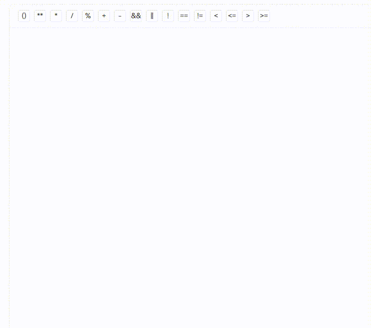

# vue-expr-editor

A lightweight, zero-dependency Vue 3 expression editor component. Based on `contenteditable`, it supports inserting immutable parameter tags alongside free-text input, expression parsing and round-trip rendering.

## Features

- Insert **parameter tags** (non-editable `<span>`) at cursor position
- Free-text editing between tags
- Round-trip: parse `{value}` patterns into tags via `displayExpression()`
- Extract structured content: expression string + parameter list via `getEditorContent()`
- Custom field mapping via `paramKeys`
- Customizable tag styles via `tagClass`
- Placeholder, disabled state support
- Full TypeScript support

## Install

```bash
npm install vue-expr-editor
```

## Quick Start

```vue
<script setup lang="ts">
import { ref } from 'vue'
import { ExprEditor } from 'vue-expr-editor'

const editor = ref<InstanceType<typeof ExprEditor>>()

const params = [
  { name: 'Username', key: 'user' },
  { name: 'Score', key: 'score' },
]

const onInsert = (param) => {
  editor.value?.insertParameterTag(param)
}

const onGetContent = () => {
  const { expr, params } = editor.value!.getEditorContent()
  console.log(expr)   // "Hello {user}, your score is {score}"
  console.log(params) // [{ name: 'Username', key: 'user' }, ...]
}
</script>

<template>
  <ExprEditor
    ref="editor"
    placeholder="Type here..."
    :param-keys="{ label: 'name', value: 'key' }"
  />
  <button @click="onInsert(params[0])">Insert Username</button>
  <button @click="onGetContent">Get Content</button>
</template>
```

## Demo



```bash
git clone https://github.com/<your-username>/vue-expr-editor.git
cd vue-expr-editor
npm install
npm run dev
```

Open the local dev server to see the interactive demo.

## API

### Props

| Prop | Type | Default | Description |
|------|------|---------|-------------|
| `paramKeys` | `{ label: string, value: string }` | `{ label: 'label', value: 'value' }` | Field mapping: which keys in your param object represent the display label and the value |
| `placeholder` | `string` | `''` | Placeholder text when editor is empty |
| `tagClass` | `string` | `''` | Additional CSS class(es) for parameter tags |
| `disabled` | `boolean` | `false` | Disable editing |

### Events

| Event | Payload | Description |
|-------|---------|-------------|
| `blur` | `EditorContent` | Fired on blur with current content |
| `change` | `EditorContent` | Fired on blur (same payload as `blur`) |

### Exposed Methods (via `ref`)

| Method | Signature | Description |
|--------|-----------|-------------|
| `getEditorContent` | `() => EditorContent` | Returns `{ expr, params }` where `expr` has `{value}` placeholders |
| `insertText` | `(content: string) => void` | Insert plain text at cursor |
| `insertParameterTag` | `(param: ParamItem) => void` | Insert a parameter tag at cursor |
| `displayExpression` | `(expression: string, paramsList?: ParamItem[]) => void` | Parse and render an expression string with `{value}` patterns as tags |
| `focus` | `() => void` | Focus the editor |
| `clear` | `() => void` | Clear all content |

### Types

```ts
interface ParamItem {
  [key: string]: any
}

interface EditorContent {
  expr: string       // e.g. "Hello {user}, score is {score}"
  params: ParamItem[] // extracted parameter objects
}
```

## Custom Styling

The default tag style is built-in. Override with `tagClass`:

```vue
<ExprEditor tag-class="my-tag" />
```

```css
.my-tag {
  background: #e8f5e9;
  color: #2e7d32;
  border-color: #a5d6a7;
}
```

## Build

```bash
npm run build
```

Outputs to `dist/`:
- `vue-expr-editor.js` (ESM)
- `vue-expr-editor.umd.cjs` (UMD)
- `*.d.ts` (type declarations)

## License

MIT
